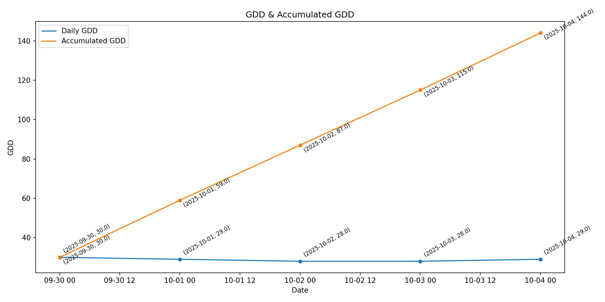

# GDD Calculation — API Usage Guide

This page documents the full workflow for calculating **Growing Degree Days (GDD)** using the OpenAgri service.  
It walks through uploading a parcel, uploading a disease model, computing GDD values over a date range, and optionally plotting the result.

---

## 1) Base URL

For this example, assume the **Pest & Disease Management (PDM)** service is available at:

```
http://localhost:8006
```

All the API paths below are relative to this base URL.

---

## 2) Upload a Disease Model

**Endpoint:**  
`POST /api/v1/disease/`

**Description:**  
Uploads or defines a disease or pest model used for GDD calculation.

**Body (JSON example):**
```json
{
  "name": "Colorado potato beetle",
  "eppo_code": "LPTNDE",
  "base_gdd": 0,
  "description": "The Colorado potato beetle is a beetle known for being a major pest of potato crops.",
  "gdd_points": [
    { "start": 0, "end": 120, "description": "Not susceptible - do not treat" },
    { "start": 120, "end": 185, "description": "Most effective time to apply Btt" },
    { "start": 185, "end": 240, "description": "Most effective time to apply conventional pesticides" },
    { "start": 240, "end": 300, "description": "No recommendation found in documentation" },
    { "start": 300, "end": 400, "description": "No recommendation found in documentation" },
    { "start": 400, "end": 675, "description": "Not susceptible -- do not treat" }
  ]
}
```

**Request:**
```bash
curl -X POST "http://localhost:8006/api/v1/disease/"   -H "Authorization: Bearer $JWT_TOKEN"   -H "Content-Type: application/json"   -d @./colorado_potato_beetle.json
```

**Response:**  
Returns a new **disease model ID (`MODEL_ID`)**.

---

## 3) Calculate GDD

**Endpoint:**  
```
GET /api/v1/tool/calculate-gdd/parcel/{parcel_id}/model/{model_ids}/verbose/{from_date}/from/{to_date}/to/
```

**Description:**  
Calculates daily and accumulated Growing Degree Days (GDD) for a given parcel and model over a time period.

**Parameters:**

| Parameter | Description | Example |
|------------|--------------|----------|
| `parcel_id` | ID of the parcel | `12345` |
| `model_ids` | ID(s) of the disease model | `6789` |
| `from_date` | Start date (YYYY-MM-DD) | `2024-03-01` |
| `to_date` | End date (YYYY-MM-DD) | `2024-09-30` |

**Example Request:**
```bash
curl -X GET   "http://localhost:8006/api/v1/tool/calculate-gdd/parcel/${PARCEL_ID}/model/${MODEL_ID}/verbose/2024-03-01/from/2024-09-30/to/"   -H "Authorization: Bearer $JWT_TOKEN"   -H "Accept: application/json"
```

**Example Response (truncated):**
```json
[
  {
    "date": "2024-03-01",
    "gdd": 4.8,
    "accumulated_gdd": 4.8
  },
  {
    "date": "2024-03-02",
    "gdd": 5.2,
    "accumulated_gdd": 10.0
  },
  {
    "date": "2024-03-03",
    "gdd": 7.1,
    "accumulated_gdd": 17.1
  }
]
```

Each record corresponds to one day and reports:
- **`gdd`**: The daily heat accumulation.
- **`accumulated_gdd`**: The cumulative sum over time.

---

## 4) What happens internally

1. The system retrieves **temperature data** for the selected parcel area between `from_date` and `to_date`.  
   - It uses daily minimum and maximum temperatures.

2. For each day, it calculates:
   ```
   GDD = ((Tmax + Tmin) / 2) - base_gdd
   ```
   where `base_gdd` is defined in the disease or pest model.

3. Negative GDD values are set to zero (since no growth occurs below the base temperature).

4. The **accumulated GDD** is computed as the running sum of all daily GDD values up to that date.

5. The service returns a detailed JSON response containing:
   - Each date in the range
   - The calculated **daily GDD**
   - The **accumulated GDD** up to that date
   - Optionally, metadata related to the disease model or parcel

---

## 6) Understanding the GDD Graph

| Line | Meaning | Interpretation |
|------|----------|----------------|
| **Daily GDD** | The daily heat accumulation (in °C·days). | Peaks and valleys correspond to temperature fluctuations. |
| **Accumulated GDD** | The cumulative sum of daily GDDs. | Indicates progression through the pest or crop development cycle. |

### Example Visualization


- **Early stage:** The accumulated line rises slowly (low temperatures).  
- **Active growth:** The slope steepens (warmer days contribute more GDD).  
- **Plateau:** As temperatures stabilize or exceed biological limits, accumulation slows.

---

## 7) Insights from the GDD Graph

The accumulated GDD curve can be directly compared with **GDD thresholds** defined in your disease or pest model.  
For example:

| GDD Range | Interpretation | Recommended Action |
|------------|----------------|--------------------|
| 0–120 | Not susceptible | No treatment needed |
| 120–185 | Optimal range for Btt | Apply biological pesticide |
| 185–240 | Chemical treatment window | Apply conventional pesticide |
| >400 | Dormant / non-susceptible | No intervention |

By aligning these thresholds with the **accumulated GDD line**, farmers and agronomists can plan **optimal intervention timings** throughout the growing season.

---

## 8) Example script

[Here](calculate_gdd.py) you can find a Python example that:
- Uploads a parcel and disease model,
- Fetches GDD data from the API,
- Parses and plots the time series.

**Dependencies:**
- `requests` (for API calls)
- `matplotlib` (for plotting, optional)

Run:
```bash
python calculate_gdd.py   --base-url https://pdm.test.horizon-openagri.eu   --token $JWT_TOKEN   --parcel-name "Parcel 1"   --wkt "POLYGON((...))"   --disease-json ./colorado_potato_beetle.json   --from-date 2024-03-01   --to-date 2024-09-30   --plot
```

---

## 9) Troubleshooting

| Issue | Possible Cause | Fix |
|--------|----------------|-----|
| `401/403 Unauthorized` | Invalid or expired JWT token | Refresh token or verify scope permissions |
| `400 Bad Request` | Invalid WKT or missing parameters | Check JSON formatting and WKT closure |
| `404 Not Found` | Wrong endpoint or missing resource | Verify parcel/model IDs and URL |
| Empty response | No weather data or out-of-range dates | Try a different date range or parcel location |

---

### ✅ Summary
The **GDD API** quantifies the thermal accumulation for a parcel-model combination.  
The resulting graph illustrates both **short-term heat variations** and **long-term crop or pest development trends**, enabling **data-driven agricultural decisions**.

