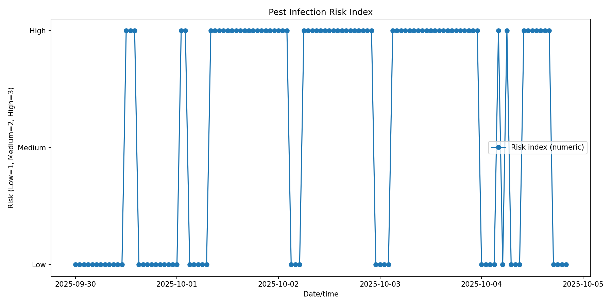

# Pest Risk Index — API Usage Guide

This page documents the end-to-end flow to upload pest models, select a parcel, and compute a **pest infection risk index** over a date range. It includes copy-pasteable `curl` snippets and a tiny parser/plotter script.

---

## 1) Authentication (JWT)

> **TBD**: How to obtain a JWT token from your identity provider (Keycloak / OAuth2 / etc.).  
> Once you have the token, all subsequent requests **must** include:

```
Authorization: Bearer JWT_TOKEN
```

You can set an environment variable for convenience:

```bash
export JWT_TOKEN="eyJhbGciOiJIUzI1NiIsInR5cCI6IkpXVCJ9..."
```

---

## 2) Base URL

Assume the Pest & Disease service is reachable at:

```
http://localhost:8006
```

All paths below are relative to this base.

---

## 3) Upload Pest Models (Excel)

**Endpoint:**  
`POST /api/v1/pest-model/upload-excel/`

**Description:**  
Upload one or more pest detection/forecast models via an Excel file.

**Example Excel:**  
An example template goes here: [PestRiskAnalysisTable](PestRiskAnalysisTable.xlsx)

**Request (multipart/form-data):**
```bash
curl -X POST "http://localhost:8006/api/v1/pest-model/upload-excel/" \
  -H "Authorization: Bearer $JWT_TOKEN" \
  -H "Accept: application/json" \
  -F "file=@./PestRiskAnalysisTable.xlsx"
```

**Response:**  
- Returns metadata of parsed models and their generated IDs.

---

## 4) List Pest Models

**Endpoint:**  
`GET /api/v1/pest-model/`

**Request:**
```bash
curl -X GET "http://localhost:8006/api/v1/pest-model/" \
  -H "Authorization: Bearer $JWT_TOKEN" \
  -H "Accept: application/json"
```

**Action:**  
Pick the **`id`** of the pest model you want to use (call it `MODEL_ID`).

---

## 5) Parcels — List or Create

### 5a) List Parcels

**Endpoint:**  
`GET /api/v1/parcel/`

```bash
curl -X GET "http://localhost:8006/api/v1/parcel/" \
  -H "Authorization: Bearer $JWT_TOKEN" \
  -H "Accept: application/json"
```

Pick the **`id`** of the parcel of interest (call it `PARCEL_ID`). Or

### 5b) Create Parcel from WKT

**Endpoint:**  
`POST /api/v1/parcel/wkt-format/`

**Body (JSON):**
```json
{
  "name": "Parcel Name",
  "wkt_polygon": "POLYGON((23.90788293506056 37.98810424577469,23.907381957300185 37.988277198315174,23.90688901661618 37.988336255186866,23.906776497547003 37.98810002741493,23.907880256035103 37.987969258142684,23.90788293506056 37.98810424577469))"
}
```

**Request:**
```bash
curl -X POST "http://localhost:8006/api/v1/parcel/wkt-format/" \
  -H "Authorization: Bearer $JWT_TOKEN" \
  -H "Content-Type: application/json" \
  -d '{"name":"Parcel Name","wkt_polygon":"POLYGON((23.90788293506056 37.98810424577469,23.907381957300185 37.988277198315174,23.90688901661618 37.988336255186866,23.906776497547003 37.98810002741493,23.907880256035103 37.987969258142684,23.90788293506056 37.98810424577469))"}'
```

**Response:**  
- Contains the new parcel’s **`id`** (`PARCEL_ID`).

---

## 6) Calculate Risk Index

**Endpoint:**  
```
GET /api/v1/tool/calculate-risk-index/weather/{parcel_id}/model/{model_ids}/verbose/{from_date}/from/{to_date}/to/
```

- `parcel_id` → `PARCEL_ID`  
- `model_ids` → one or multiple `MODEL_ID` (comma-separated)  
- `from_date`, `to_date` → `YYYY-MM-DD` (or ISO-8601)  

**Example:**
```bash
curl -X GET \
  "http://localhost:8006/api/v1/tool/calculate-risk-index/weather/${PARCEL_ID}/model/${MODEL_ID}/verbose/2025-09-30/from/2025-10-04/to/" \
  -H "Authorization: Bearer $JWT_TOKEN" \
  -H "Accept: application/ld+json"
```

**Response (JSON-LD excerpt, truncated):**
```json
{
  "@context": ["https://w3id.org/ocsm/main-context.jsonld"],
  "@graph": [{
    "@type": ["ObservationCollection"],
    "description": "…",
    "hasMember": [
      {
        "@type": ["Observation","PestInfestationRisk"],
        "phenomenonTime": "2025-09-30T12:00:00",
        "hasSimpleResult": "high"
      }
      // …
    ]
  }]
}
```

> Each `hasMember` entry corresponds to a risk observation at a given time (`phenomenonTime`) with a qualitative risk label (`hasSimpleResult`: e.g., `Low`, `high`).

---

## 7) Parse & Plot Risk Series

[Here](plot_risk_index.py) you can find a **small Python script** that:
- Parses the JSON-LD response,
- Extracts a time series of `(date, risk_value)`, and

> **Dependencies:**  
> - Required: `requests` (only if you fetch from the API in the script; you can also paste JSON into a file)  
> - For plotting: `matplotlib`

Exaple usage
```bash
python risk_plot.py < response.json
```

where `response.json` is the JSON-LD retrieve from risk index API above.

Example graph



The graph visualizes the pest infection risk index over time for a selected parcel and pest model.

The x-axis shows the dates (formatted as MM-DD).

The y-axis represents the risk level, typically mapped as:

1 → Low risk

2 → Medium risk

3 → High risk

Each point (date, value) corresponds to an hourly or daily risk observation returned by the API.

The line connects these observations, allowing you to see how the pest infection risk evolves through time — highlighting when the risk increases (e.g., during favorable conditions for infestation).

## 8) Usage script

[Here](calculate_risk_index.py) you can find a script that consists all of the above functionality

---

## 9) Troubleshooting

- **401/403**: Check your JWT token and scopes.  
- **404**: Verify path segments, especially `parcel_id`, `model_ids`, and date formats.  
- **Empty `hasMember`**: Your time window or model may not yield risk observations for that parcel; try a different date range or ensure weather/model inputs are available.  
